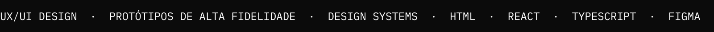

<a href="https://ganwalk.github.io/portifolio/">
  <picture>
    <source media="(prefers-color-scheme: dark)" srcset="assets/header-dark.svg?v=3">
    
  </picture>
</a>
<picture>
  <source media="(prefers-color-scheme: dark)" srcset="assets/marquee-dark.svg">
  
</picture>

Curioso em tempo integral, sou um pouco de tudo: apaixonado por música, ilustrador, entusiasta de tecnologia, nerd de assuntos aleatórios, e já há uma década transformei minha vontade de criar em profissão.

Hoje desenho produto num banco e atendo clientes no mundo todo, criando experiências interativas guiadas por dados, SEO, performance e um ótimo bom gosto (o meu!).

Baseado no Brasil · Disponível para projetos no mundo todo 🌍

### Projetos em destaque

| Projeto | O que fiz | Abrir |
| :--- | :--- | :--- |
| **Ecossistema AUVP** | Desenho e mantenho o ecossistema de webpages da AUVP Capital. 20 mil+ acessos diários, performance mínima 90+/100, conversão acima de 8%. | [case](https://ganwalk.github.io/portifolio/pt/work/ecossistema-auvp/) |
| **Intranet AUVP** | Construí uma intranet para todo o ecossistema, com Design System completo: 70 componentes documentados, 110 componentes React. | [case](https://ganwalk.github.io/portifolio/pt/work/intranet-auvp/) · [código](https://github.com/ganwalk/intranet) · [site](https://ganwalk.github.io/intranet/) |
| **Ganwalk** | Desenhei a identidade visual interativa: logotipo de partículas em WebGL e um painel de mixagem ao vivo no navegador. | [case](https://ganwalk.github.io/portifolio/pt/work/ganwalk/) · [código](https://github.com/ganwalk/2026) · [site](https://ganwalk.github.io/2026/) |
| **Dezert Horse** | Projetei um deserto em Three.js com um painel retrô que toca o álbum inteiro, faixa a faixa. | [case](https://ganwalk.github.io/portifolio/pt/work/dezert-horse/) · [código](https://github.com/ganwalk/cavalo) · [site](https://ganwalk.github.io/cavalo/) |
| **Pink Opala** | Desenvolvi o site oficial do duo indie pop de Goiânia, sem build nem framework. | [case](https://ganwalk.github.io/portifolio/pt/work/pink-opala/) · [código](https://github.com/ganwalk/pinkopala) · [site](https://ganwalk.github.io/pinkopala/) |

### Vamos conversar?

Aberto a projetos, colaborações e boas ideias.

[Portfólio](https://ganwalk.github.io/portifolio/) · [LinkedIn](https://br.linkedin.com/in/armando-custodio-00080320a) · [Instagram](https://www.instagram.com/ganwalk) · [Email](mailto:armandocustodio0@gmail.com)

Feito à mão, com ajuda de máquinas.
